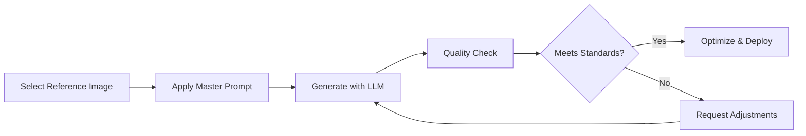

# KardTrust Brand Image Generation - Implementation Summary

## 📋 Project Overview

This document summarizes the comprehensive brand image generation system created for replacing template stock imagery across the KardTrust website with brand-consistent, hyper-realistic photography featuring custom vector graphic overlays.

---

## 🎯 Brand Analysis Complete

### Logo Analysis: `kardtrust-logo-dark.png`

**Extracted Brand Elements:**

1. **Brand Red (Shield & Arrow):** `#D72638`
   - RGB: (215, 38, 56)
   - Usage: Upward-pointing arrows representing financial growth
   - Metaphor: Progress, momentum, improvement

2. **Brand Blue (Four-Pointed Stars):** `#003DA5`
   - RGB: (0, 61, 165)
   - Usage: Four-pointed stars representing trust and excellence
   - Metaphor: Guidance, reliability, premium service

3. **Core Visual Metaphors:**
   - Shield = Security and protection
   - Upward Arrow = Financial growth
   - Four-Pointed Stars = Trust and excellence
   - Combined = "Your Trusted Guide to Finance in the United States"

---

## 📚 Documentation Created

### Primary Documents

| Document                    | Purpose                                              | Location                                      |
| --------------------------- | ---------------------------------------------------- | --------------------------------------------- |
| **Master Generation Guide** | Comprehensive prompt template and usage instructions | `/docs/BRAND_IMAGE_GENERATION_PROMPT.md`      |
| **Quick Reference**         | Copy-paste prompt for rapid generation               | `/docs/BRAND_IMAGE_QUICK_PROMPT.md`           |
| **Visual Specifications**   | Detailed technical and design specs                  | `/docs/BRAND_VISUAL_SPECIFICATIONS.md`        |
| **Implementation Summary**  | This overview document                               | `/docs/BRAND_IMAGE_IMPLEMENTATION_SUMMARY.md` |

---

## 🚀 Ready-to-Use Prompt Template

### Core Prompt Structure

The master prompt has been designed for multi-modal image generation LLMs (DALL-E 3, Midjourney, Stable Diffusion XL) and includes:

1. **Photography Requirements**
   - Hyper-realistic quality standards
   - Subject composition guidelines
   - Lighting and color grading specifications

2. **Vector Graphics Specifications**
   - Exact brand colors (#D72638, #003DA5)
   - Red upward arrows (2-4 per image)
   - Blue four-pointed stars (3-6 per image)
   - Size hierarchy and placement rules

3. **Composition Architecture**
   - Depth layering (elements behind and in front of subject)
   - Asymmetric balance with 40-50% breathing room
   - Visual flow guiding eye upward

4. **Technical Output Specs**
   - 1920x1080 minimum resolution
   - Landscape format (16:9 or 3:2)
   - Web-optimized WebP format

---

## 🎨 Key Design Principles

### DO ✅

- Use exact hex values: `#D72638` (red), `#003DA5` (blue)
- Create upward-pointing arrows (growth metaphor)
- Use four-pointed stars (trust symbol)
- Maintain hyper-realistic photography quality
- Keep 40-50% breathing room in composition
- Layer vector elements for depth
- Balance asymmetrically
- Guide eye movement upward

### DON'T ❌

- Use off-brand colors or gradients
- Create downward or lateral arrows
- Obscure subject's face with graphics
- Clutter the composition
- Over-process photography
- Use generic star shapes
- Center everything symmetrically
- Forget the breathing room

---

## 🔄 Workflow Overview

### Three-Phase Process



### Step-by-Step

1. **Preparation**
   - Select original template image as reference
   - Open master prompt from `/docs/BRAND_IMAGE_QUICK_PROMPT.md`
   - Customize for specific context (outdoor/office/urban)

2. **Generation**
   - Attach reference image to multi-modal LLM
   - Paste customized prompt
   - Generate initial version

3. **Quality Control**
   - Verify exact brand colors used
   - Check all old graphics removed
   - Confirm arrows point upward
   - Validate star design (four points)
   - Ensure breathing room maintained
   - Test composition balance

4. **Iteration** (if needed)
   - Request specific adjustments
   - Regenerate with refinements
   - Re-validate against checklist

5. **Optimization**
   - Convert to WebP format (85% quality)
   - Generate responsive variants (1920px, 1280px, 768px)
   - Store in appropriate directory
   - Add descriptive alt text

6. **Deployment**
   - Replace old template images
   - Update Next.js Image components
   - Test on staging environment
   - Deploy to production

---

## 📁 File Organization

### Recommended Structure

```markdown
/public/images/
├── hero/
│ ├── kardtrust-hero-credit-card-woman-outdoor-v1.webp
│ ├── kardtrust-hero-tablet-woman-office-v1.webp
│ └── kardtrust-hero-shopping-woman-urban-v1.webp
├── blog/
│ ├── kardtrust-blog-financial-planning-man-office-v1.webp
│ └── kardtrust-blog-savings-woman-home-v1.webp
├── cards/
│ └── [thumbnail versions]
├── originals/
│ └── [high-res source files before optimization]
└── deprecated/
├── woman-with-credit-card.avif (OLD - DO NOT USE)
├── woman-with-tablet.avif (OLD - DO NOT USE)
└── woman-shopping.avif (OLD - DO NOT USE)
```

### Naming Convention

```text
kardtrust-[type]-[context]-[subject]-[setting]-v[version].webp
```

**Examples:**

- `kardtrust-hero-credit-card-woman-outdoor-v1.webp`
- `kardtrust-blog-loans-man-home-v2.webp`
- `kardtrust-card-savings-woman-office-v1.webp`

---

## 🎯 Target Image Inventory

### Priority Replacements

Based on the attached reference images, prioritize generating:

1. **Homepage Hero**
   - Reference: `woman-with-credit-card.avif`
   - Context: Outdoor, confident, credit card focus
   - Priority: ⭐⭐⭐⭐⭐ (Highest)

2. **Office/Professional**
   - Reference: `woman-with-tablet.avif`
   - Context: Professional setting, tablet/business
   - Priority: ⭐⭐⭐⭐

3. **Shopping/Lifestyle**
   - Reference: `woman-shopping.avif`
   - Context: Urban, casual, shopping context
   - Priority: ⭐⭐⭐⭐

### Additional Images Needed

- Credit card comparison page hero
- Personal loans category hero
- Blog article headers (5-10 variations)
- About Us page team/office imagery
- Financial guidance lifestyle shots

---

## 🛠️ Technical Integration

### Next.js Implementation

```typescript
// Example: Using new branded image in Next.js component
import Image from "next/image";

export default function HeroSection() {
  return (
    <section className="relative">
      <Image
        src="/images/hero/kardtrust-hero-credit-card-woman-outdoor-v1.webp"
        alt="Smiling woman confidently holding credit card outdoors with laptop, surrounded by upward red arrows and blue stars representing financial growth and trust"
        width={1920}
        height={1080}
        priority
        quality={85}
        className="w-full h-auto"
      />
    </section>
  );
}
```

### Responsive Image Sets

```typescript
// Example: Responsive images with srcSet
<Image
  src="/images/hero/kardtrust-hero-credit-card-woman-outdoor-v1.webp"
  srcSet="
    /images/hero/kardtrust-hero-credit-card-woman-outdoor-v1-768w.webp 768w,
    /images/hero/kardtrust-hero-credit-card-woman-outdoor-v1-1280w.webp 1280w,
    /images/hero/kardtrust-hero-credit-card-woman-outdoor-v1-1920w.webp 1920w
  "
  sizes="(max-width: 768px) 768px, (max-width: 1280px) 1280px, 1920px"
  alt="..."
  width={1920}
  height={1080}
/>
```

---

## ✅ Quality Assurance Checklist

### Pre-Generation

- [ ] Reference image selected and analyzed
- [ ] Context identified (hero, blog, card, etc.)
- [ ] Master prompt customized for specific use case
- [ ] Brand colors verified (#D72638, #003DA5)

### Post-Generation

**Photography Quality:**

- [ ] Hyper-realistic, professional appearance
- [ ] Proper lighting and exposure
- [ ] Natural color grading with warm tones
- [ ] Sharp focus on subject
- [ ] Clean, uncluttered background
- [ ] Authentic subject portrayal

**Brand Elements:**

- [ ] All old vector graphics (blue/green) removed
- [ ] Exact Brand Red (#D72638) used for arrows
- [ ] Exact Brand Blue (#003DA5) used for stars
- [ ] Arrows point upward (45-90° angles)
- [ ] Stars are four-pointed (compass style)
- [ ] Size hierarchy is correct (large, medium, small)

**Composition:**

- [ ] 40-50% breathing room maintained
- [ ] Asymmetric but balanced layout
- [ ] Depth layering visible (elements behind and in front)
- [ ] Subject's face not obscured
- [ ] Visual flow guides eye upward
- [ ] No cluttered or cramped areas

**Technical:**

- [ ] Minimum 1920px width
- [ ] Landscape orientation (16:9 or 3:2)
- [ ] WebP format with 85% quality
- [ ] File size optimized (under 500KB)
- [ ] Alt text is descriptive and accessible
- [ ] Proper filename following naming convention

---

## 📊 Success Metrics

### Quality Indicators

- **Brand Consistency:** 100% adherence to color specifications
- **Visual Impact:** Improved engagement on pages with new imagery
- **Load Performance:** Maintain Core Web Vitals (LCP < 2.5s)
- **Accessibility:** All images have descriptive alt text
- **User Feedback:** Positive response to brand refresh

### Testing Checklist

- [ ] Desktop viewing (1920px+)
- [ ] Tablet viewing (768px-1280px)
- [ ] Mobile viewing (320px-767px)
- [ ] Color blindness simulation (protanopia, deuteranopia)
- [ ] Screen reader alt text clarity
- [ ] Page load speed impact
- [ ] Cross-browser compatibility (Chrome, Safari, Firefox, Edge)

---

## 🔗 Related Documentation

### Project Context

- **Main Instructions:** `.github/copilot-instructions.md`
- **Project Rules:** `.github/instructions/project-rules.instructions.md`
- **Brand Guidelines:** `/BRANDING.md`

### Technical References

- **Next.js Image Optimization:** [Next.js Docs](https://nextjs.org/docs/app/api-reference/components/image)
- **WebP Conversion:** Use `sharp` or online tools
- **Alt Text Guidelines:** WCAG 2.1 Level AA standards

---

## 🎓 Training & Handoff

### For Designers

1. Review `/docs/BRAND_VISUAL_SPECIFICATIONS.md` for complete design specs
2. Familiarize with brand colors and vector element styles
3. Practice with 2-3 test images before production batch
4. Use quality checklist for every generated image

### For Developers

1. Review Next.js image integration examples above
2. Set up responsive image pipeline (generate 3 sizes per image)
3. Implement proper alt text system
4. Monitor performance impact with Lighthouse

### For Content Creators

1. Use `/docs/BRAND_IMAGE_QUICK_PROMPT.md` for rapid generation
2. Follow three-step workflow: select, generate, verify
3. Maintain consistency across all content
4. Archive old images in `/public/images/deprecated/`

---

## 🚦 Next Steps

### Immediate Actions

1. **Generate Initial Batch**
   - Create 3 hero images from provided references
   - Test with development LLM access
   - Validate against quality checklist

2. **Review & Refine**
   - Stakeholder review of first batch
   - Gather feedback and iterate
   - Finalize prompt adjustments

3. **Production Batch**
   - Generate full inventory (10-15 images)
   - Optimize all for web deployment
   - Create responsive variants

4. **Implementation**
   - Replace old template images site-wide
   - Update Next.js Image components
   - Deploy to staging for testing
   - Production release

### Long-Term Maintenance

- **Quarterly Review:** Assess image freshness and relevance
- **Seasonal Updates:** Consider seasonal variations (if appropriate)
- **Performance Monitoring:** Track Core Web Vitals impact
- **Accessibility Audits:** Regular WCAG compliance checks
- **Archive Management:** Maintain organized deprecated folder

---

## 📞 Support & Questions

### Documentation References

- **Complete Prompt:** `/docs/BRAND_IMAGE_GENERATION_PROMPT.md`
- **Quick Guide:** `/docs/BRAND_IMAGE_QUICK_PROMPT.md`
- **Visual Specs:** `/docs/BRAND_VISUAL_SPECIFICATIONS.md`

### Common Issues

**Issue:** Generated arrows point sideways or downward  
**Solution:** Emphasize in prompt: "CRITICAL: All arrows must point upward at 45-90° angles representing financial growth"

**Issue:** Stars don't look like brand logo stars  
**Solution:** Clarify: "Four-pointed star like North Star or compass rose, NOT five-pointed star, NOT generic sparkle"

**Issue:** Colors don't match brand  
**Solution:** Always include exact hex in prompt: "Use EXACT hex #D72638 for red, #003DA5 for blue. Do not approximate."

**Issue:** Composition too cluttered  
**Solution:** Add to prompt: "CRITICAL: Maintain 40-50% negative space. Use maximum 4 arrows and 6 stars. Breathing room is essential."

---

## ✨ Summary

You now have a complete, production-ready system for generating brand-consistent, hyper-realistic stock imagery for KardTrust:

- ✅ **Brand colors extracted** from logo (#D72638, #003DA5)
- ✅ **Comprehensive prompt template** for multi-modal LLMs
- ✅ **Detailed visual specifications** for consistency
- ✅ **Quick reference guide** for rapid generation
- ✅ **Quality checklists** for validation
- ✅ **Integration examples** for Next.js
- ✅ **File organization system** for deployment

The system is designed to be:

- **Reusable** across all image generation needs
- **Consistent** with KardTrust brand identity
- **Scalable** for ongoing content creation
- **Accessible** with proper alt text guidelines
- **Performant** with WebP optimization

Proceed with generating your first batch using the quick prompt reference, and iterate based on the quality checklist!

---

**Document Version:** 1.0  
**Last Updated:** October 2025  
**Status:** ✅ Ready for Production Use
